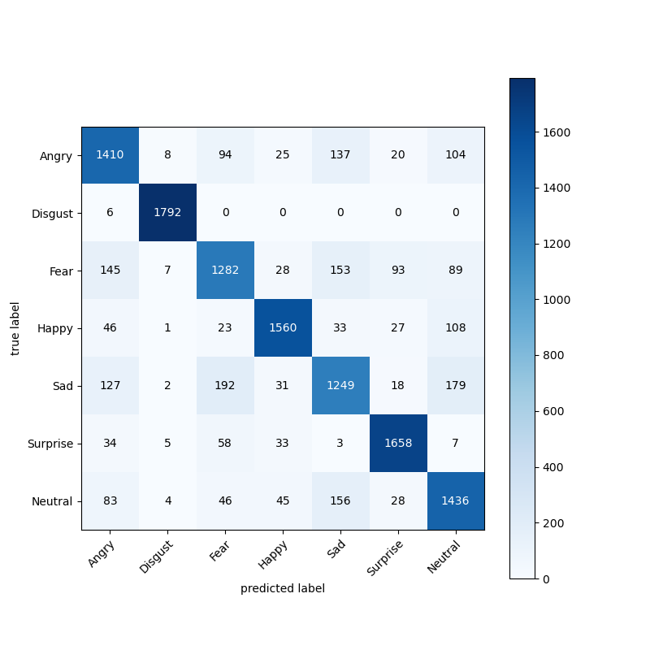

# Emotionality

This website aims to assist in evaluating the usability of a system. Allows the creation of projects, creation of teams, attribution of usability tests carried out with users to the project and visualization of results. It has the particularity of analyzing the impact that facial emotions have when using traditional usability evaluation methods such as cognitive walkthrough and usability smells. 
Images/model1_acc_loss.png

- [Sobre](#sobre)
  - [Objetivos](#objetivos)

## Sobre

Esta seção pode conter informações detalhadas sobre o seu projeto.

### Objetivos
#User Testing Websites

## Figure 1: MODEL 1

## Figure 2: MODEL 2

## Figure 3: MODEL 4

## Figure 4: MODEL 5

## Figure 5: MODEL 6

## Figure 6: Relational database model of the user testing website

## Figure 7: Website Test Navbar

## Figure 8: User Testing Website Signup

## Figure 9: User Testing Website Signin

## Figure 10: User Testing Website Account Update (Type A)

## Figure 11: User Testing Website Account Update (Type B)

## Figure 12: Search for Products (Type A and B)

## Figure 13: Search for Products by Various Criteria (Type A and B)

## Figure 14: Incomplete Product Search (Type B)

## Figure 15: Add Product to Cart (Type A and B)

## Figure 16: Product Purchase Checkout (Type A and B)

## Figure 17: Payment Information (Type A and B)

## Figure 18: Payment Method Verification (Type A and B)

## Figure 19: User Testing Website Review (Type A)

## Figure 20: User Testing Website Review (Type B)

## Figure 21: Usability Problem on User Testing Website B Review

## Figure 22: Relational Database Model of the Final Website

## Figure 23: Navbar Before Team Leader Login

## Figure 24: Team Leader Signup

## Figure 25: Team Leader Signin

## Figure 26: Team Leader Account Update

## Figure 27: Project Update

## Figure 28: Project Creation

## Figure 29: Project Management

## Figure 30: Usability Test Upload

## Figure 31: Usability Tests

## Figure 32: Update Usability Test Video

## Figure 33: Split Usability Test into Tasks

## Figure 34: Upload Usability Test Task

## Figure 35: Delete Usability Test Task

## Figure 36: Usability Smells

## Figure 37: Create Usability Smell

## Figure 38: Edit Usability Smell

## Figure 39: Project Invitations

## Figure 40: Create Project Invitation

## Figure 41: Managing Permissions for Results Consolidation

## Figure 42: Viewing Team Members' Work Progress

## Figure 43: Usability Tests Results (Team Members)

## Figure 44: Cumulative Frequency of Facial Emotions

## Figure 45: Error Rate

## Figure 46: Average Task Completion Time

## Figure 47: Satisfaction Rate

## Figure 48: Website Usability Survey

## Figure 49: Usability Test Analysis

## Figure 50: Export Usability Test Results

## Figure 51: Export Error Rate Results

## Figure 52: Export Task Completion Time Results

## Figure 53: Export Satisfaction Rate Results

## Figure 54: Export Cumulative Frequency of Facial Emotions

## Figure 55: Closing the Session

