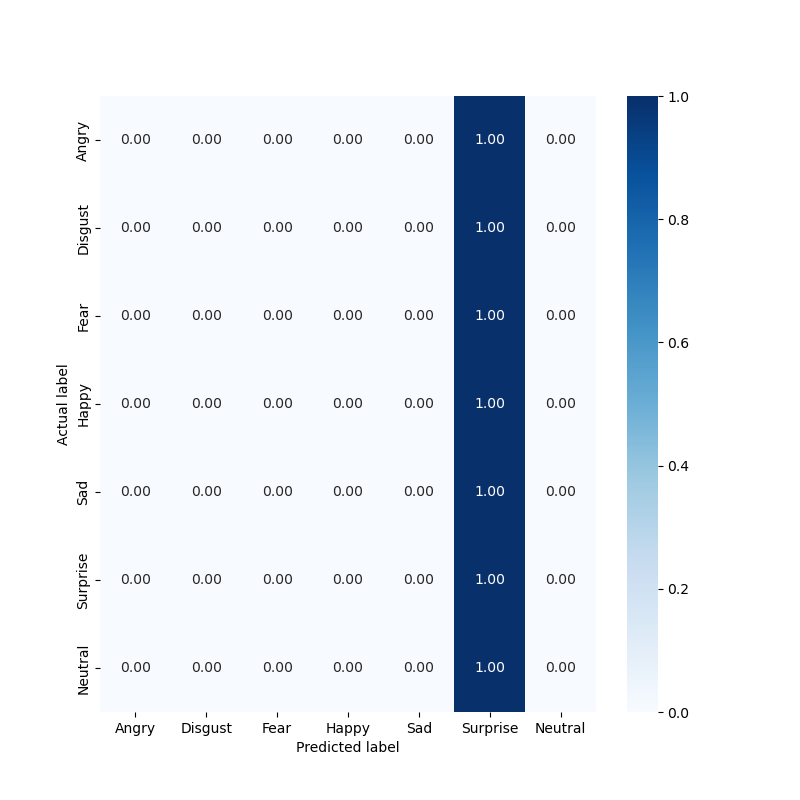

# The Role of Facial Emotions in Usability Evaluation

Repository containing all the development work and additional documentation that provides a more detailed complement to what was mentioned in the master dissertation document titled 'The Role of Facial Emotions in Usability Evaluation,' authored by Alexandre Antunes Rodrigues.

## Indice
- [Facial Emotion Recognition Algorithm](#facial-emotion-recognition-algorithm)
- [User Testing Websites](#user-testing-websites)
  - [Functional requirements](#functional-requirements)
  - [Usability Smells](#usability-smells)
  - [Database description](#database-description)
  - [Usability Testing Tasks](#usability-testing-tasks)
  - [Examples](#examples)
- [Usability Tests](#usability-tests)
  - [Consent performed on Google Forms](#consent-performed-on-google-forms)
- [Inspection methods](#inspection-methods)
  - [Semiotic Inspection Method](#semiotic-inspection-method)
- [Predictive Evaluation](#predictive-evaluation)
  - [GOMS](#goms)
  - [KLM](#klm)
- [The Emotionality Tool](#the-emotionality-tool)
  - [Emotinality functional requirements](#emotinality-functional-requirements)
    - [Common to All Stakeholders](#common-to-all-stakeholders)
    - [Team Leader Functional Requirements](#team-leader-functional-requirements)
    - [Team Member Functional Requirements](#team-member-functional-requirements)
  - [Emotinality non-functional requirements](#emotinality-non-functional-requirements)
  - [Emotionality database description](#emotionality-database-description)
  - [Stakeholders common views](#stakeholders-common-views)
  - [Team leader system functionalities](#team-leader-system-functionalities)
  - [Team member system functionalities](#team-leader-system-functionalities)
  - [Heuristic Evaluation Google Forms Consent](#heuristic-evaluation-google-forms-consent)

## Facial Emotion Recognition Algorithm

All models created are represented in the graphs below.

**Model 1**

**Model 2**

**Model 4**

**Model 5**

**Model 6**

## User Testing Websites
To enhance the integration of strategic usability problems into a testable system, we've developed two websites, collectively named "TechIST," for buying and selling tech products. These sites, User Testing Website A and User Testing Website B differ in usability design. The development code for both websites can be found in the User Testing Websites folder in google drive.

User Testing Website A was created without intentional usability problems, while User Testing Website B was intentionally designed with strategic usability issues. These websites serve as a controlled environment for user testing, enabling a detailed comparative analysis of user experiences and the effects of strategic usability problems on interactions and overall satisfaction.

### Functional Requirements

The functional requirements specified below are applicable to both User Testing Website A and User Testing Website B.

- **User Registration (REQ-1):**
  - The system should provide a registration feature that allows users to create an account by providing their first name, last name, email address, and a password that meets specific requirements such as minimum length and complexity. Additionally, the system should differentiate between team leaders and team members during the registration process.

- **User Authentication (REQ-2):**
  - The system must enable users to log in to their accounts using their username and password. The system should validate both the username and password entered by the user and display appropriate error messages if the login information is incorrect (e.g., incorrect email or password).

- **Update User Account (REQ-3):**
  - Users should have the ability to securely update their personal information within the system. This functionality should allow users to modify their first name, last name, username, email address, and current password.

- **Logout (REQ-4):**
  - The system must provide a secure logout feature that allows users to log out of their accounts when desired.

- **Products (REQ-5):**
  - **Search Functionality (REQ-5.1):**
    - The system should provide users with a search functionality that allows them to search for products using a search bar. Additionally, users should be able to filter search results based on price range, categories, products in stock, new or used items, items on sale, and the type of seller.

  - **Read Project Data (REQ-5.2):**
    - The system should offer a well-organized and easily searchable product catalog. This catalog should enable users to browse through available products, providing detailed product descriptions and options for purchase.

- **Shopping Cart (REQ-6):**
  - **Add Products to Cart (REQ-6.1):**
    - The system must include a cart system that allows users to add products to their shopping cart for future purchases.

  - **Update Shopping Cart (REQ-6.2):**
    - Users should have the ability to view and modify the contents of their shopping cart. They should be able to update quantities of items and remove products as needed.

  - **Check Out (REQ-6.3):**
    - The system must provide users with a checkout feature that allows them to proceed to the payment method once they have completed their shopping.

  - **Payment (REQ-6.4):**
    - The system should allow users to finalize their purchase by entering payment information, such as payment type, card number, card code, expiration month and year, and address.

  - **Payment Method Verification (REQ-6.5):**
    - The system must verify that the card number provided consists of sixteen digits and that the card code consists of three digits, ensuring the accuracy and security of the payment process.

  - **Purchase History (REQ-6.6):**
    - The system should provide users with access to their purchase history, allowing them to review information about all previous purchases made. This information should be easily accessible within the user's account area.

- **Review (REQ-7):**
  - **Add Website Reviews (REQ-7.1):**
    - The system should provide users with the ability to add reviews about the website. Users should be able to enter their username, user email, a description of their review, and a rating. This feature allows users to share their feedback and experiences with the website, contributing to the overall assessment and evaluation of its performance.

### Usability Smells

The following list outlines the usability smells that were utilized for evaluation purposes:

- **No client validation:** This usability smell refers to the absence of validation checks on the client side when inputting data into forms. Without proper client validation, users may submit incorrect or incomplete information, leading to errors or difficulties down the line. For example, if a form does not validate email addresses or requires specific formats for certain inputs but does not provide feedback or error messages, users may encounter issues when submitting the form. 

- **Late validation:** refers to a usability smell where validation checks for user inputs or actions occur after a significant delay or at a later stage in the process. Instead of providing immediate feedback on errors or invalid inputs, the system waits until later in the user flow to validate the information. This can lead to confusion and frustration for users as they may not be aware of their mistakes until they have progressed further in the process.

- **Abandoned form:** This usability smell occurs when users start filling out a form but abandon it before completing the process. It suggests that users may encounter difficulties or frustrations while interacting with the form, leading to abandonment. Common reasons for abandoned forms include complex or confusing layouts, unclear instructions, excessive or irrelevant form fields, or technical issues. 

- **Go to wrong page/Misleading link:** This usability smell indicates situations where users are directed to the wrong page or misled by a link that does not accurately represent the content or destination. For example, clicking on a link that promises one thing but takes the user to an unrelated or unexpected page can cause confusion and disrupt the user's flow. Misleading links can lead to frustration and impact the user's trust in the website or application. 

- **Long-time request:** This usability smell refers to situations where user requests or actions take a long time to process or complete, causing delays and potential frustration. For example, if a page takes an excessively long time to load or a transaction processing request takes an extended period without any indication of progress, users may become impatient or assume that the system is unresponsive. 

- **Form field with short input:** This usability smell occurs when form fields restrict the length or format of user input without providing clear instructions or feedback. For instance, if a form field limits the number of characters that can be entered, but users are not informed about the limit or given real-time feedback, they may encounter issues when attempting to input their desired information. 

- **Search with few search results:** This usability smell refers to situations where a search form or function returns a limited or inadequate number of search results. Users expect search results to be relevant, comprehensive, and reflective of their query. If the search functionality consistently provides few or irrelevant results, users may experience frustration and difficulty in finding the information they need. 

- **Click action unresponsive element:** This usability smell occurs when users click on an element or perform an action, but the system or interface does not respond as expected or fails to provide feedback. Unresponsive elements can confuse users and give the impression that the system is unresponsive or malfunctioning. A lack of visual or interactive feedback can lead to uncertainty and affect the user's perception of the system's usability.

### Database description
The database consists of the following entities:

- **ShoppingCartItem:** This entity represents an item in the shopping cart. It includes an attribute for the quantity of the product and a reference to the Product model.

- **Product:** The Product model represents a technology product and includes attributes such as name, price, description, image, quantity, stock, brand, category, creation date, condition (new or used), and seller information. It is associated with the ShoppingCartItem template.

- **Promotion:** The Promotion template represents a product promotion and includes attributes like name, discount, description, and deadline. It is linked to the Product model.

- **Sold:** This model represents sold products and includes attributes for quantity, seller information, total amount, and the sale date. It has a reference to the Product model.

- **Comment:** The Comment model stores comments made by users on specific products. It includes attributes for description, rating, and the posting date. It is associated with the Product model.

- **PaymentMethod:** This model represents payment methods used to finalize product purchases. It includes attributes for card type and number.

- **ShoppingCart:** The ShoppingCart model contains the ID of the ShoppingCartItem model.

- **Payment:** The Payment model represents payment details, including address, total amount, available credits (if applicable), and payment date. It is associated with the PaymentMethod template.

These entities collectively form the structure of the system's database, facilitating the organization and management of data for the user testing website.

### Usability Testing Tasks

- **Sign up on the TechIST website**
  - Locate the "Login" button in the navbar.
  - Click the "Login" button.
  - Click the "Sign-up" button.
  - Go to the sign-up page.
  - Enter valid personal data such as username, email, and password.
  - Confirm that everything is filled out correctly.
  - Click on the "Sign-up" button.
    
- **Sign in**
  - Go to the login page.
  - Enter the username and password.
  - Confirm that everything is filled in correctly.
  - Click the "Sign in" button.
  - Account Settings
    
- **Add your first and last name and change your username**
  - Locate the "Account" button in the navbar.
  - Click the account button.
  - Go to the account page.
  - Click the "Update Account" button.
  - Add your first and last name and change your username.
  - Add the password.
  - Confirm that everything is filled in correctly.
  - Click the "Update User" button.
  - Product Search
    
- **Search for a product via the search bar (text input)**
  - Locate the "Products" button in the navbar.
  - Locate the search bar.
  - Insert the word "drone" into it.
  - Click on the search button.
  - Purchase a Product
    
- **Buy an iPhone 14 Pro Max 128GB Deep Purple**
  - Search for the product "iPhone 14 Pro Max 128GB Deep Purple" in the search bar or search for the word "iPhone" in the categories.
  - Add the product to the cart.
  - Locate the "Cart" button in the navbar.
  - Click the "Check out" button.
  - Select the payment method.
  - Fill out the form with your card details and personal details.
  - Confirm that everything is filled out correctly.
  - Click on the "Buy" button.
    
- **Add a review about TechIST website**
  - Go to the home page.
  - Locate the "Add a review" form at the bottom of the page.
  - Fill out the form.
  - Confirm that everything is filled out correctly.
  - Click the "Add" button.

- **Logout**
  - Locate the "Logout" button in the navbar.
  - Click the "Logout" button.

### Examples

**User Testing Website Navbar**

**User Testing Website Signup**

**User Testing Website Signin**

**User Testing Website Account Update**

**User Testing Website Type B Account Update**

**Product Search on User Testing Website**

**Advanced Product Search on User Testing Website**

**Incomplete Product Search on User Testing Website Type B**

**Add Product to Cart**

**Perform Product Purchase Checkout**

**Fill in Payment Details**

**Payment Method Verification**

**Fill out a Review on the User Testing Website**

**Fill out a Review on User Testing Website Type A**

**Fill out a Review on User Testing Website Type B**

**Go to Wrong Page/Misleading Link" Issue on User Testing Website Type B**

## Usability Tests

### Consent performed on Google Forms

## Inspection methods

### Semiotic Inspection Method

Semiotic Inspection Method is a comprehensive usability evaluation approach that analyzes visual, textual, and interactive elements
within interfaces, drawing from semiotic theory to assess signs, coherence, and consistency. It complements traditional usability evaluation techniques, providing insights into the symbolic aspects of user
interfaces. When used alongside user testing, it offers a holistic understanding of how a system communicates with its users (BarbosaEtAl2021InteracaoHumanoComputadorExperiencia). This method involves a systematic process, including familiarization with the
interface, element identification, semiotic analysis, user interpretation, issue identification, recommendations for improvement, and integration with other evaluation methods. Scrutinizing the meaning and
communicative effectiveness of interface elements, helps detect and resolve usability issues, ultimately
improving the user experience (BarbosaEtAl2021InteracaoHumanoComputadorExperiencia).

**References**

**BarbosaEtAl2021InteracaoHumanoComputadorExperiencia**: Simone Diniz Junqueira Barbosa, Bruno Santana da Silva, Milene Selbach Silveira, Isabela Gasparini, Ticianne Darin, and Gabriel Diniz Junqueira Barbosa. Intera¸c ao Humano-Computador e
ExperienciadoUsu´ario.Autopublica¸c ao, 2021.

## Predictive Evaluation
Predictive evaluation is a valuable approach to assessing an interface's usability even before its actual implementation. This evaluation method does not require user involvement and is particularly suitable for systems with well-defined and predictable tasks. It relies on psychological principles and experimental techniques to achieve its objectives. The process involves two main phases.

Initially, the sequence and individual steps of the tasks are identified and documented. Subsequently, a thorough analysis of these steps is conducted to determine various usability measures. These measures include identifying potential error-prone steps within the task sequence and estimating the time required to complete each step successfully (gonccalves2017introduccao, ribeiro2019usability).

### GOMS
The GOMS (Goals, Operators, Methods, and Selection Rules) model, developed john1995goms, is a valuable framework for analyzing user-system interaction complexity. The model adopts a "divide and conquer" approach, where users accomplish goals by tackling sub-goals. The term \ac{GOMS} is an abbreviation for four key components: Goals, Operators, Methods, and Selection Rules.

Goals represent the desired outcomes that users aim to achieve within the system. Operators refer to the cognitive processes and physical actions that users perform to accomplish these goals. Methods comprise sequences of steps required to reach a goal or sub-goal. Selection Rules come into play when multiple methods are available for achieving a particular goal, guiding the decision-making process to determine the most appropriate method to employ (gonccalves2017introduccao, rosyidah2019usability).
### KLM 
The KLM, developed by the same authors as the GOMS model mentioned earlier, is a valuable tool for estimating task execution time. This model takes into account the expertise of evaluators and breaks down the execution phase into six distinct operators: five physical-motor operators and one mental operator. Additionally, it includes an operator related to the system's response time capability (gonccalves2017introduccao)

The KLM provides a structured approach for evaluating the time required to perform specific tasks by considering the physical and cognitive actions involved. By analyzing the sequence of operators and their associated time values, the model allows for the estimation of task completion time and facilitates the identification of potential bottlenecks or areas for improvement in interface design and interaction flow (gonccalves2017introduccao).

**References**

**gonccalves2017introduccao:** D Gonc ̧alves, MJ Fonseca, and P Campos. Introduc ̧  ̃ao ao design de interfaces. Lisboa: FCA-
Editora de Inform  ́atica, Ltda, 2017

**ribeiro2019usability:** Rafael Fontinele Ribeiro, Matheus de Meneses Campanh  ̃a Souza, Pedro Almir Martins
de Oliveira, and Pedro de Alc ˆantara dos Santos Neto. Usability problems discovery based on
the automatic detection of usability smells. In Proceedings of the 34th ACM/SIGAPP Symposium
on Applied Computing, pages 2328–2335, 2019.

**john1995goms:** Bonnie John. Why goms? interactions, 2(4):80–89, 1995 

**rosyidah2019usability:** Umi Rosyidah, Hanny Haryanto, and Acun Kardianawati. Usability evaluation using goms model
for education game “play and learn english”. In 2019 International Seminar on Application for
Technology of Information and Communication (iSemantic), pages 1–5. IEEE, 2019.

## The Emotionality Tool

The Emotionality Tool was developed to address the absence of a comprehensive and freely available system for evaluating the usability of user testing websites, aligning with the objectives of this master's thesis focused on investigating the role of facial emotions in usability assessment. This tool offers functionalities for loading, storing, and extracting insights from pairs of videos recorded during usability tests. These video pairs include a webcam recording capturing the user's facial expressions and a monitor recording capturing the user's interactions with the target system. This dissertation provides a thorough exploration of the stakeholders, requirements, architecture, and potential of "The Emotionality Tool" system in fulfilling its intended purpose.

### Emotinality functional requirements

#### Common to All Stakeholders

- **User Registration (REQ-1):** The system must provide a user registration feature where users can create an account by providing their first name, last name, email address, and a password that meets specified requirements. The registration process should differentiate between team leaders and team members.
- **User Authentication (REQ-2):** The system should enable users to log in using their registered username (email) and password. The system must validate the provided credentials and display appropriate error messages if the login information is incorrect, such as an invalid email or password.
- **Update User Account (REQ-3):** The system should provide users with the capability to update their personal data securely. This feature allows users to modify their account information, such as name, email address, or password.
- **Logout (REQ-4):** The system must include a secure logout functionality that allows users to log out from their accounts when needed.

#### Team Leader Functional Requirements

- **Project Management (REQ-6)**
  - **Create Project Data (REQ-6.1):** The system must allow for the creation of new projects by defining their name, description, start date, and end date in a valid and formatted way.
  - **Read Project Data (REQ-6.2):** The system must allow for the presentation of data in a readable and organized format, and the filtering of the same from the name, description, start date, and end date of at least one project.
  - **Update Project Data (REQ-6.3):**  The system must allow editing of the already created date of a given project in a valid and formatted way.
  - **Delete Project Data (REQ-6.4):** he system must allow for deleting one or more projects by filtering for name, description, start date, and end date.

- **Project Data Management (REQ-7)**
  - **Upload Usability Testing Data (REQ-7.1):** The system must provide the functionality to upload both the webcam video recorder and the screen video recorder for a usability test. Additionally, it should allow assigning a usability testing name, user type (A or B), user ID, and the location where the test was performed.
  - **Usability Testing Data Storage (REQ-7.2):** When uploading videos for a usability test, the system should store only the screen video recorder in the designated database. The facial emotions detected by a classification algorithm on the webcam video recorder must also be stored securely and anonymously.
  - **Read Usability Testing Data (REQ-7.3):** The system must present usability testing data in a readable and organized format. Users should be able to filter the data by project name, project description, user type, user ID, location, and whether the screen video data has been divided into tasks.
  - **Update Usability Testing Data (REQ-7.4):** The system must allow valid and properly formatted editing of existing usability testing data within a given project.
  - **Delete Usability Testing Data (REQ-7.5):** Users should be able to delete one or more usability testing data based on filtering criteria such as project name, project description, user type, user ID, location, and whether the screen video data has been divided into tasks.
  - **Split Usability Testing Data (REQ-7.6):** The system should enable the splitting of each usability testing screen video into task-based sub-videos. These sub-videos should have the same duration and be associated with corresponding names and actions for use in the CW.
  - **Update Usability Testing Data (Split) (REQ-7.7):**Users should have the ability to edit already split usability testing data, ensuring the data remains valid and properly formatted.
  - **Delete Usability Testing Data (Split) (REQ-7.8):** The system must allow the deletion of split usability testing data associated with a specific usability test, considering appropriate filtering options.
  - **Create Usability Smells (REQ-7.9):** The system must provide the functionality to create a list of usability smells, including their names and descriptions.
  - **Read Usability Smells (REQ-7.10):** Usability smells data should be presented in a readable and organized format. Users should be able to filter the data based on usability smell names and descriptions.
  - **Update Usability Smells (REQ-7.11):** Users should have the ability to edit usability smells, ensuring the changes are valid and properly formatted.
  - **Delete Usability Smells (REQ-7.12):** The system must allow the deletion of one or more usability smells, providing filtering options based on name and/or description.
    
- **Project Invitations (REQ-8)**
  - **Create Project Invitation (REQ-8.1):** The system should enable the creation of project invitations by selecting one or more projects for a specific team member via their email.
  - **Read Project Invitation (REQ-8.2):** The system must present project invitations in a readable and organized format, allowing filtering by project name, team member name, team member email, start date, end date, and creation date.
  - **Delete Project Invitation (REQ-8.3):** The system must provide the capability to delete one or more project invitations based on filtering criteria such as project name, team member name, team member email, start date, end date, and creation date.
  
- **Conclusions (REQ-9)**
  - **Permission to Consolidate Usability Testing Results (REQ-9.1):** The system should display the usability evaluation progress of all tasks from all usability tests conducted by team members in a readable and organized format. Additionally, it should include a button to grant permission for consolidating the results.
  - **Read Team Members' Usability Testing Results (REQ-9.2):** The system must present the progress of usability evaluation for tasks from all usability tests conducted by team members. This information should be displayed in a readable and organized format, allowing the selection of a usability test to view the usability evaluation of each team member.
  - **Read Usability Testing Results (REQ-9.3):** For each task-based usability test associated with a specific usability test, the system should be capable of displaying the cumulative frequency and distribution of facial emotions. Additionally, it should present the consolidated usability testing results for each usability testing method.
  - **Search Usability Testing Results (REQ-9.4):** The system should allow filtering of usability testing results by user type for each task-based usability testing associated with a specific usability test.
  - **Usability Testing Results from Data Export (REQ-9.5):** The system must provide the functionality to export usability testing results in data in a CSV file format for one or both user types.

  - **Read Team Members' Overall Usability Testing Results (REQ-9.6):** The system should allow the presentation of quantitative end results from the consolidated results. This includes displaying the distribution of each emotion's cumulative frequency across all tasks in all usability tests, the distribution of usability problems across all tasks in all usability tests, and the number of usability problems encountered with or without the help of facial emotions for each task-based usability testing associated with a specific usability test.

  - **Search Overall Usability Testing Results (REQ-9.7):** For each overall usability test, the system must allow filtering of results by user type.

  - **Overall Usability Testing Results Data Export (REQ-9.8):** The system should enable the export of overall usability testing results from data in a CSV file format for one or both user types.

#### Team Member Functional Requirements

- **Project Invitations (REQ-10)**
  - **Read Project Invitation (REQ-10.1):** The system must allow the presentation of project invitations in a readable and organized format. Users should be able to filter invitations by project name, team leader name, team leader email, start date, and end date.
  - **Accept Project Invitation (REQ-10.2):** The system should allow team members to accept project invitations sent by team leaders, indicating their participation in the given project.

    
- **Usability Evaluation Projects (REQ-11)**
  - **Access to Usability Evaluation Methods for Each Project (REQ-11.1):** The system should display all projects and their corresponding usability evaluation methods directly in the navigation bar, providing easy access to these options.
  - **Read Usability Tests (REQ-11.2):** For each usability test associated with a specific project and usability evaluation method, the system must present the data in a readable and organized format. Additionally, it should display the progress of usability evaluation tasks for all usability tests and allow the user to select a usability test for evaluation, with or without the assistance of facial emotions.
  
- **Usability Evaluation with CW (REQ-11.3):**
  - **Read Tasks-Based Usability Testing (REQ-11.3.1):** For each task-based usability test within a pre-selected usability test, the system should display information and actions related to each task in a readable format. It should indicate whether the usability evaluation of the task has already been performed and provide a button to initiate the evaluation process.
  - **Evaluate Task-Based Usability Testing (REQ-11.3.2):**     The system should present the actions associated with pre-selected task-based usability testing in a readable format. It should include the four CW questions and respective fields for answering them. A field for writing notes and a checkbox to indicate whether the task has been evaluated should also be provided.
 
- **Usability Evaluation with Usability Smells (REQ-11.4):**
  - **Read Tasks-Based Usability Testing (REQ-11.4.1):**    For each task-based usability test within a pre-selected usability test, the system should display information about each task in a readable format. It should indicate whether the usability evaluation of the task has already been performed and provide a button to initiate the evaluation process.
  - **Evaluate Task-Based Usability Testing (REQ-11.4.2):**     The system should present a list of usability smells in a readable format, allowing users to select relevant ones. It should include a field for writing notes and a checkbox to indicate whether the task has been evaluated.
  - **Usability Testing Results from Consolidation (REQ-12)**

- **Usability Evaluation with CW (REQ-12.1):**
  - **Read Usability Tests (REQ-12.1.1):**     The system should present information about the usability tests conducted for a specific project. This includes details such as the project end date, usability test name, user type, user ID, location, permission status for consolidating results with other team members, and the option to choose whether to consolidate usability testing results with or without the assistance of facial emotions.
  - **Read Tasks-Based Usability Testing (REQ-12.1.2):**     For each task-based usability test within a pre-selected usability test, the system must display information about each task in a clear and readable format. It should indicate whether the usability evaluation for the task has been conducted and provide a button to initiate the usability evaluation of the task with all associated team members.
  - **Usability Testing Results Consolidation (REQ-12.1.3):**     The system should present the actions associated with the pre-selected tasks-based usability testing in a readable format. It should include the four CW questions and provide fields for answering them. A field for writing notes and a checkbox to indicate whether the task has already been evaluated should also be available.
- **Usability Evaluation with Usability Smells (REQ-12.2):**
  - **Read Usability Tests (REQ-12.2.1):** Similar to the CW approach, the system should display information about the usability tests conducted for a specific project. This includes details such as the project end date, usability test name, user type, user ID, location, permission status for consolidating results with other team members, and the option to choose whether to consolidate usability testing results with or without the assistance of facial emotions.
  - **Read Tasks-Based Usability Testing (REQ-12.2.2):** For all tasks-based usability testing of a given usability test pre-selected by the user, the system must display the information of each task in a readable format, whether the usability evaluation of the task has already taken place and a button to evaluate the usability of the task in order to start the evaluation together with all team members.
  - **Evaluate Task-Based Usability Testing (REQ-12.2.3):** The system must present in a readable format a list of usability smells with the option to select them, a field to write notes, and a checkbox to mention if the task has already been evaluated.

### Emotinality non-functional requirements

- **Performance:** The system must demonstrate efficient performance by ensuring fast loading times, with pages loading within a maximum of 3 seconds. 
- **Availability:** The system should maintain a high level of availability, ensuring uninterrupted access to users. Scheduled maintenance activities and system downtime should be carefully planned and minimized to minimize disruptions to user accessibility.
- **Security:** The system should be secure, with measures to protect user data and prevent unauthorized access or attacks, such as SSL encryption.
- **Usability:** The system should prioritize usability, providing a user-friendly experience for individuals with varying levels of technical proficiency. It should feature an intuitive and well-organized interface, ensuring ease of navigation and smooth user interaction.

**The Emotionality Tool security.**

## Emotionality database description

- **TeamLeader:** A model that extends the built-in Django User model to represent a project leader.
- **TeamMember:** A model that extends the built-in Django User model to represent a project member.
- **Project:** A model representing a project, led by a team leader and involving multiple team members. It encompasses attributes such as name, description, start and end dates, and a reference to the leading team leader.
- **UsabilitySmells:** A model representing usability smells identified for a specific project. It includes a reference to the corresponding project and a description.
- **HeuristicEvaluation:** A model representing the results of a heuristic evaluation conducted on the project. It includes a reference to the associated project and a description of the evaluation.
- **Video:** A template representing a video recording of a usability test. It includes a reference to the relevant project, usability test name, user type, UID, location, and multiple video files.
- **Invitations:** A template representing invitations sent to team members to join a project. It includes references to the project and team members involved, along with a boolean field indicating the acceptance status of the invitation.
- **ResultsConsolidation Permission:** A model representing the authorization granted for consolidating usability test results. It includes a reference to the corresponding video and a boolean field indicating whether authorization was given.
- **SubVideoTask:** A model representing a subtask performed by a team member during a usability test. It includes a reference to the associated video and detailed information about the subtask, such as task number, task name, performed actions, and a reference to the UsabilitySmells model.
- **SubVideoTaskEmotionsPlot:** A model representing the user's emotional state during the subtask. It includes a reference to the corresponding SubVideoTask and the plot data.
- **UsabilityEval_CW_Smells_Emotion:** A model representing the results of a usability evaluation of the subtask considering emotions. It includes a reference to the associated subtask, the team member who conducted the evaluation, and the evaluation results, including answers to questions and selected usability smells.
- **UsabilityEval_CW_Smells_without_Emotion:** A model representing the results of a usability evaluation of the subtask without considering emotions. It includes a reference to the corresponding subtask, the team member who conducted the evaluation, and the evaluation results, including answers to questions and selected usability smells.
- **ResultsConsolidation:** A model representing the consolidation of all results from CW and Usability Smells evaluations, both with and without emotions.

## Stakeholders common views**

**Navbar Before Team Leader Login**

**Team Leader Signup**

**Team Leader Sign in**

**Team Leader Account Update**

**Results consolidation**

## Team leader system functionalities

**Project Update on the Final Website**

**Project Creation on the Final Website**

**Project Management on the Final Website**

**Uploading the Usability Test on the Final Website**

**Usability Tests on the Final Website**

**Uploading Usability Test on the Final Website**

**Usability Test Split into Tasks on the Final Website**

**Uploading Usability Test Task on the Final Website**

**Delete Usability Test Task on the Final Website**

**Usability Smells on the Final Website**

**Create Usability Smell on the Final Website**

**Edit Usability Smell on the Final Website**

**Project Invitations on the Final Website**

**Create Project Invitations on the Final Website**

**Managing Permissions for Team Leaders to Consolidate Results**

**Viewing of Team Members' Work Progress by the Team Leader**

**Usability Tests Results by Team Members**

**Cumulative Frequency of Facial Emotions and the Distribution of Facial Emotions**

**Export All Results in .CSV Format by Selecting the Type of User Usability Website**

**Consolidated Usability Evaluations (Focus on the Usability Problems Found)**

**Quantitative End-Results from the Consolidated Results**

**Export Overall Results in .CSV Format by Selecting the Type of User Usability Website**

**Cumulative Frequency of Facial Emotions**

## Team member system functionalities

**Navbar before the team member has logged in**

**Navbar after the team member has logged in**

**Team member project invitations**

**Team member usability evaluation methods choice**

**Monitor recorded video and facial emotions side by side**

**Facial emotions plot**

**Progress of each task evaluated**

**Usability evaluation using CW**

**Usability evaluation using usability smells**

**Usability evaluation results using CW**

**Usability evaluation results using usability smells**

**Consolidation of results using CW between team members**

**Consolidation of results using usability smells between team members**

**The Emotionality Tool performance scores**

## Heuristic Evaluation Google Forms Consent

**Google Forms Consent**

